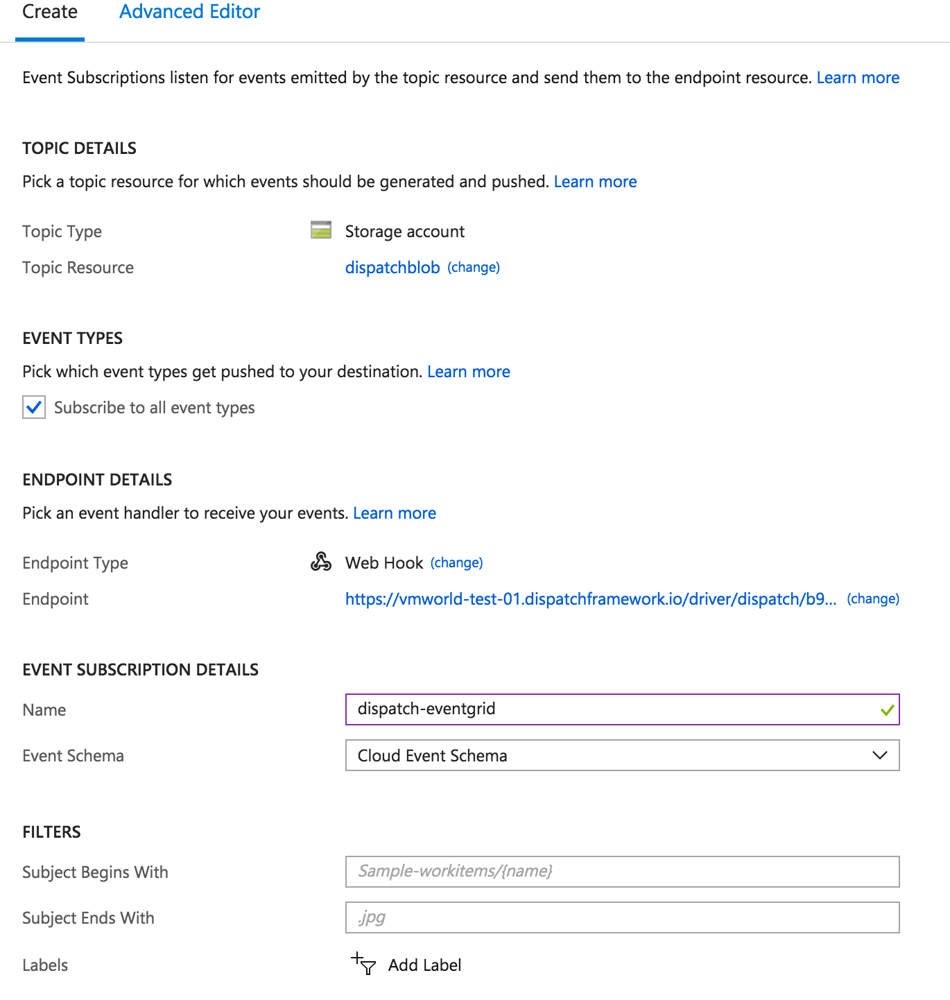

# Cross-Cloud Services Demo

This demo leverages services of two clouds (Azure and AWS) and leverages Dispatch as the glue between them.

## Goal

Azure Blob Storage -> Eventgrid -> Dispatch -> AWS Rekognition -> Slack

## Install the Azure Event Driver

```
dispatch create -f eventdriver.yaml
```

## Create Azure Storage Bucket

Links:
* https://docs.microsoft.com/en-us/azure/event-grid/manage-event-delivery
* https://docs.microsoft.com/en-us/azure/storage/blobs/storage-blob-event-quickstart?toc=%2fazure%2fevent-grid%2ftoc.json

1. Create a container in Azure Blob Storage
2. Create an event subscription forwarding the event to the event driver URL
    * ensure cloudevent schema

## Add secrets

1. Add Azure storage credentials:
    ```azure-secrets.json
    {
        "azure_account_name": "...",
        "azure_account_key": "...",
        "azure_public_container": "..."
    }
    ```
    `dispatch create secret azure-storage azure-secrets.json`
2. Add Slack webhook url:
    ```slack-secrets.json
    {
        "webhook-url": "https://hooks.slack.com/services/..."
    }
    ```
    `dispatch create secret slack slack-secrets.json`

## Create the rekognition service

1. Create the recognition service instance:
    `dispatch create -f rekognition.yaml`

## Run the demo

1. Create the eventgrid driver type and driver:
    `dispatch create -f eventdriver.yaml`
2. Create the eventgrid subcription pushing to Dispatch:
    - Open [Azure portal](https://portal.azure.com/#blade/Microsoft_Azure_EventGrid/ListEventSubscriptionsFromSubscriberBlade)
    - Create the subscription emitting cloudevents 
3. Show contents of label.py function highlighting dependencies, secret injection and service injection.
4. Create the image with required dependencies:
    `dispatch create -f image.yaml`
5. Create the label function:
    `dispatch create -f function.yaml`
5. Subscribe the label function to the azure event:
    `dispatch create -f subscription.yaml`
1. Upload pic to label:
    `az storage blob upload --file hotdog.png --container-name dispatchcontainer --name hotdog.png`

